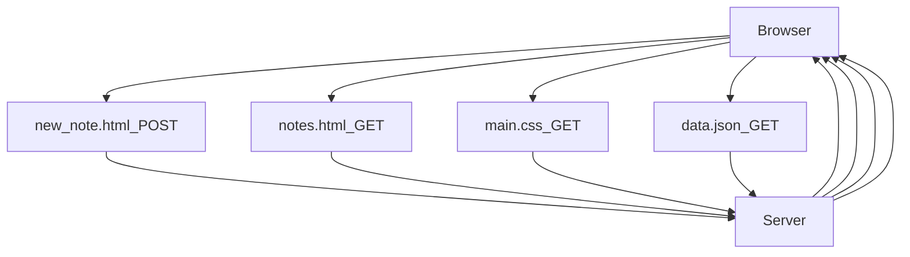

Kaavio mitä tapahtuu, kun käyttäjä luo uuden muistiinpanon (Vasemmalta oikealle päin):

```mermaid
graph TD;
    Browser-->new_note.html_POST-->Server -->Browser;
    Browser-->notes.html_GET-->Server-->Browser;
    Browser-->main.css_GET-->Server-->Browser;
    Browser-->data.json_GET-->Server-->Browser;
```
