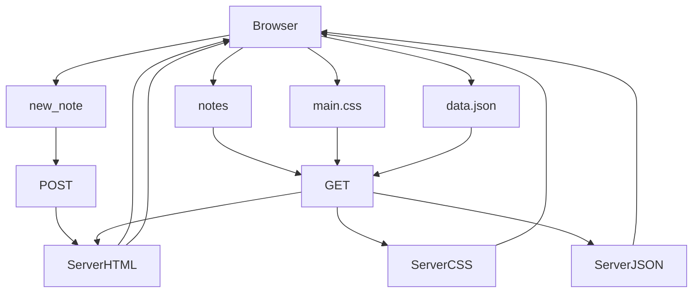

Kaavio mitä tapahtuu, kun käyttäjä luo uuden muistiinpanon:

```mermaid
graph TD;
    Browser-->new_note-->POST-->ServerHTML -->Browser;
    Browser-->notes-->GET-->ServerHTML-->Browser;
    Browser-->main.css-->GET-->ServerCSS-->Browser;
    Browser-->data.json-->GET-->ServerJSON-->Browser;
```
