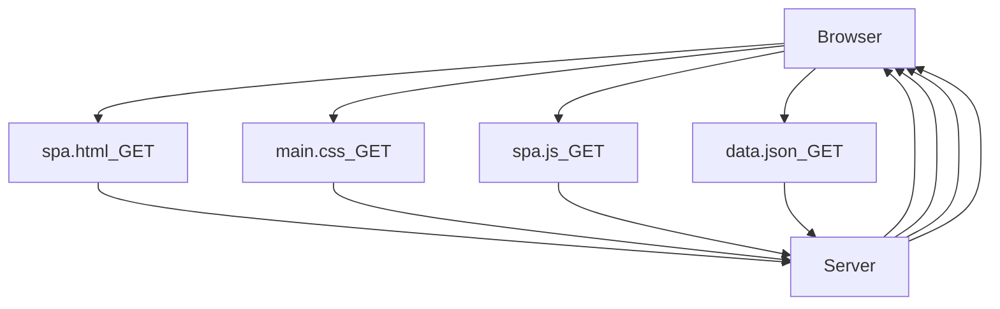

Kaavio mitä tapahtuu, kun käyttäjä menee single page app (Vasemmalta oikealle päin):

```mermaid
graph TD;
    Browser-->spa.html_GET-->Server-->Browser;
    Browser-->main.css_GET-->Server-->Browser;
    Browser-->spa.js_GET-->Server-->Browser;
    Browser-->data.json_GET-->Server-->Browser;
```
